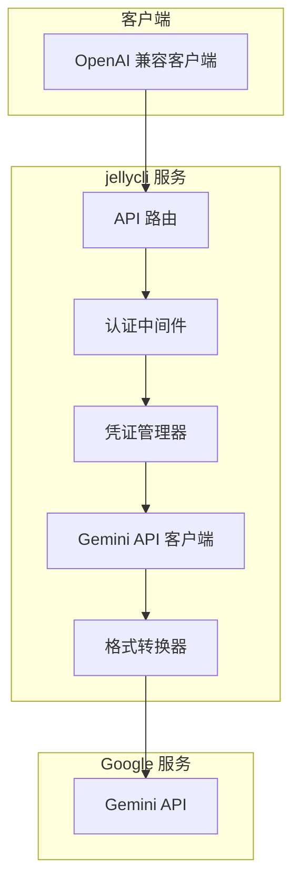

# jellycli

[](https://crates.io/crates/jellycli)
[](LICENSE)
[](https://rustlang.org)

**jellycli** 是一个用 Rust 编写的高性能 API 转换服务，它将 Google Gemini API 转换为 OpenAI API 兼容格式，使得各种支持 OpenAI API 的工具和应用程序能够无缝使用 Google Gemini 模型。

## ✨ 功能特性

- 🔄 **API 格式转换**: 无缝转换 OpenAI 和 Gemini API 之间的请求和响应格式
- 🌊 **流式响应支持**: 完全支持流式和非流式响应，包括假流式模式
- 🔑 **多凭证管理**: 智能轮换多个 Google OAuth 凭证，绕过使用限制
- 🔄 **自动令牌刷新**: 自动处理 access token 的过期和刷新
- 📊 **状态监控**: 实时监控凭证状态，记录成功和错误信息
- 🛡️ **错误处理**: 完善的错误处理和重试机制
- ⚡ **高性能**: 基于 Rust 和 Tokio 异步运行时，提供出色的性能
- 🔒 **安全认证**: 内置 API 密码认证保护

## 🏗️ 项目架构



### 核心组件

- **认证模块**: 管理 Google OAuth 凭证，包括加载、刷新、轮换和状态跟踪
- **客户端模块**: 实现 Gemini API 客户端，处理与 Google 服务的通信
- **模型模块**: 定义 API 数据结构和转换逻辑
- **路由模块**: 提供 OpenAI 兼容的 API 端点
- **工具模块**: 提供配置管理、日志记录等辅助功能

## 🚀 快速开始

### 环境要求

- Rust 1.70+
- Google OAuth 凭证文件

### 安装


#### 从release 安装

从release 下载二进制文件

#### 从源码构建

```bash
git clone https://github.com/yourusername/jellycli.git
cd jellycli
cargo build --release
```


### 配置

1. 复制配置文件模板：
```bash
cp config.example.json config.json
```

2. 编辑 `config.json` 文件：

```json
{
  "password": "your_secure_password",
  "bind_address": "0.0.0.0:7878",
  "credentials_dir": "./credentials",
  "code_assist_endpoint": "https://cloudcode-pa.googleapis.com",
  "calls_per_rotation": 100,
  "max_retries": 3
}
```

### 配置项说明

| 配置项 | 类型 | 默认值 | 说明 |
|--------|------|--------|------|
| `password` | String | "pwd" | API 访问密码 |
| `bind_address` | String | "0.0.0.0:7878" | 服务绑定地址 |
| `credentials_dir` | String | "./credentials" | 凭证文件目录 |
| `code_assist_endpoint` | String | "https://cloudcode-pa.googleapis.com" | Gemini API 端点 |
| `calls_per_rotation` | Number | 1 | 每个凭证的最大调用次数 |
| `max_retries` | Number | 3 | 最大重试次数 |

### 凭证设置

1. 创建 `credentials` 目录：
```bash
mkdir credentials
```

2. 将 Google OAuth 凭证文件放入 `credentials` 目录，文件格式为 JSON：

```json
{
  "access_token": "your_access_token",
  "refresh_token": "your_refresh_token",
  "client_id": "your_client_id",
  "client_secret": "your_client_secret",
  "project_id": "your_project_id",
  "expiry": "2025-08-15T10:00:00Z"
}
```

### 启动服务

```bash
cargo run
# 或者使用发布版本
./target/release/jellycli
```

服务启动后，可以通过以下地址访问：
- API 端点: `http://localhost:7878/v1`
- 健康检查: `http://localhost:7878/health`

## 📖 使用指南

### 支持的模型

- `gemini-2.5-pro-preview-06-05`
- `gemini-2.5-pro-preview-06-05-假流式`
- `gemini-2.5-pro`
- `gemini-2.5-pro-假流式`
- `gemini-2.5-pro-preview-05-06`
- `gemini-2.5-pro-preview-05-06-假流式`

### API 端点

#### 聊天补全

**端点**: `POST /v1/chat/completions`

**请求示例**:
```bash
curl -X POST http://localhost:7878/v1/chat/completions \
  -H "Content-Type: application/json" \
  -H "Authorization: Bearer your_password" \
  -d '{
    "model": "gemini-2.5-pro",
    "messages": [
      {
        "role": "user",
        "content": "Hello, how are you?"
      }
    ],
    "stream": false
  }'
```

**响应示例**:
```json
{
  "id": "chatcmpl-123",
  "object": "chat.completion",
  "created": 1677652288,
  "model": "gemini-2.5-pro",
  "choices": [{
    "index": 0,
    "message": {
      "role": "assistant",
      "content": "Hello! I'm doing well, thank you for asking. How can I help you today?"
    },
    "finish_reason": "stop"
  }],
  "usage": {
    "prompt_tokens": 12,
    "completion_tokens": 20,
    "total_tokens": 32
  }
}
```

#### 流式聊天补全

**请求示例**:
```bash
curl -X POST http://localhost:7878/v1/chat/completions \
  -H "Content-Type: application/json" \
  -H "Authorization: Bearer your_password" \
  -d '{
    "model": "gemini-2.5-pro",
    "messages": [
      {
        "role": "user",
        "content": "Tell me a short story"
      }
    ],
    "stream": true
  }'
```

#### 模型列表

**端点**: `GET /v1/models`

**请求示例**:
```bash
curl -X GET http://localhost:7878/v1/models \
  -H "Authorization: Bearer your_password"
```

#### 健康检查

**端点**: `GET /health`

**请求示例**:
```bash
curl -X GET http://localhost:7878/health
```

### 使用示例

#### Python 示例

```python
import openai

# 配置 OpenAI 客户端指向 jellycli 服务
client = openai.OpenAI(
    api_key="your_password",
    base_url="http://localhost:7878/v1"
)

# 非流式请求
response = client.chat.completions.create(
    model="gemini-2.5-pro",
    messages=[
        {"role": "user", "content": "Explain quantum computing in simple terms."}
    ]
)
print(response.choices[0].message.content)

# 流式请求
stream = client.chat.completions.create(
    model="gemini-2.5-pro",
    messages=[
        {"role": "user", "content": "Write a poem about artificial intelligence."}
    ],
    stream=True
)
for chunk in stream:
    if chunk.choices[0].delta.content:
        print(chunk.choices[0].delta.content, end="")
```

#### cURL 示例

```bash
# 非流式请求
curl -X POST http://localhost:7878/v1/chat/completions \
  -H "Content-Type: application/json" \
  -H "Authorization: Bearer your_password" \
  -d '{
    "model": "gemini-2.5-pro",
    "messages": [
      {"role": "user", "content": "What is the capital of France?"}
    ]
  }'

# 流式请求
curl -X POST http://localhost:7878/v1/chat/completions \
  -H "Content-Type: application/json" \
  -H "Authorization: Bearer your_password" \
  -d '{
    "model": "gemini-2.5-pro",
    "messages": [
      {"role": "user", "content": "Count from 1 to 10 slowly."}
    ],
    "stream": true
  }'
```

## 🔧 高级配置

### 多凭证管理

jellycli 支持使用多个 Google OAuth 凭证，并在它们之间自动轮换。这对于绕过单个凭证的使用限制非常有用。

1. 将多个凭证文件放入 `credentials` 目录
2. 设置 `calls_per_rotation` 来控制每个凭证的使用次数
3. 服务会自动在凭证之间轮换

### 凭证状态管理

jellycli 会跟踪每个凭证的状态，包括：
- 成功和错误记录
- 最后成功时间
- 是否禁用

状态信息保存在 `credentials/creds_state.toml` 文件中。

### 日志配置

可以通过环境变量控制日志级别：

```bash
RUST_LOG=info cargo run
RUST_LOG=debug cargo run
RUST_LOG=error cargo run
```

## 🛠️ 开发指南

### 开发环境设置

1. 克隆仓库：
```bash
git clone https://github.com/yourusername/jellycli.git
cd jellycli
```

2. 安装开发依赖：
```bash
cargo install cargo-watch
```

3. 运行开发服务器：
```bash
cargo watch -x run
```

### 运行测试

```bash
cargo test
```

### 代码格式化

```bash
cargo fmt
```

### 代码检查

```bash
cargo clippy
```

## 🤝 贡献指南

我们欢迎所有形式的贡献！请遵循以下步骤：

1. Fork 本仓库
2. 创建特性分支 (`git checkout -b feature/amazing-feature`)
3. 提交更改 (`git commit -m 'Add some amazing feature'`)
4. 推送到分支 (`git push origin feature/amazing-feature`)
5. 创建 Pull Request

### 开发规范

- 遵循 Rust 官方代码风格
- 编写清晰的文档注释
- 为新功能添加测试
- 确保所有测试通过
- 更新相关文档

## 📄 许可证

本项目采用 MIT 许可证 - 详情请参阅 [LICENSE](LICENSE) 文件。

## 🙏 致谢

- [OpenAI](https://openai.com/) - 提供了广泛使用的 API 标准
- [Google](https://ai.google/) - 提供了强大的 Gemini 模型
- [Rust](https://rust-lang.org/) - 提供了高性能的系统编程语言
- [Axum](https://github.com/tokio-rs/axum) - 提供了优秀的 Web 框架

## 📞 支持

如果您遇到问题或有建议，请：

1. 查看 [常见问题](docs/FAQ.md)
2. 搜索现有的 [Issues](https://github.com/yourusername/jellycli/issues)
3. 创建新的 Issue 描述您的问题

## 📊 性能基准

jellycli 在标准硬件上的性能表现：

| 指标 | 值 |
|------|-----|
| 请求延迟 | < 100ms |
| 并发连接数 | 1000+ |
| 内存使用 | ~50MB |
| CPU 使用率 | 低 |

---

**⭐ 如果这个项目对您有帮助，请给我们一个 Star！**